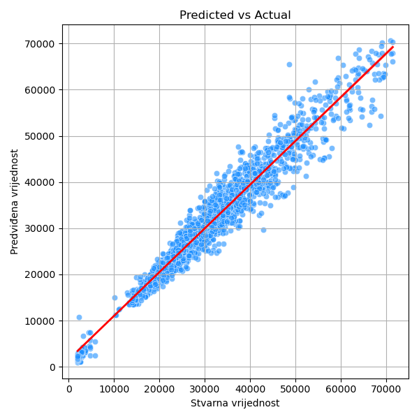
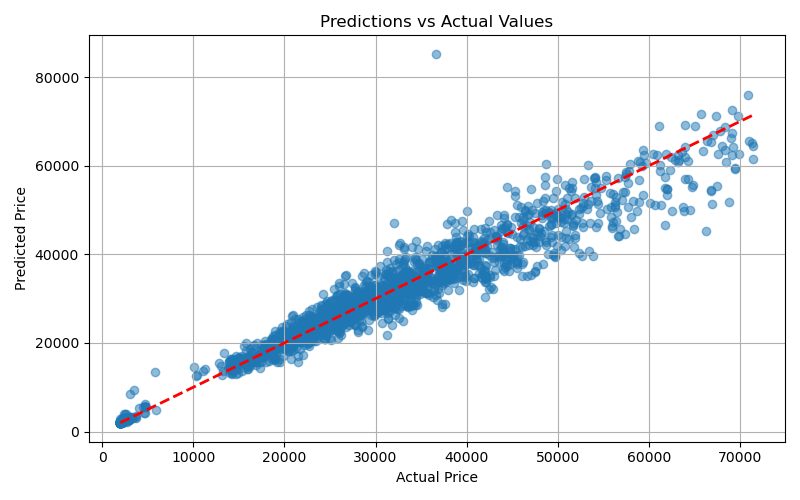

# 🚗 CarPricePredictor

**Full-stack Data Science projekt za predikciju cijena automobila**  
Od CSV-a do interaktivnog web sučelja s vizualizacijama i predikcijama.

---

## 1️⃣ O projektu

**CarPricePredictor** demonstrira kompletan workflow Data Science projekta, uključujući istraživanje podataka, treniranje ML/DL modela, evaluaciju, API backend i interaktivni frontend.  

**Zašto je projekt važan:**  
Predikcija cijena automobila pomaže korisnicima i trgovcima da bolje razumiju tržište, optimiziraju cijene i donose informirane odluke.

**Workflow:**  
CSV dataset -> Preprocessing -> Model Training -> Evaluation -> REST API -> Frontend Display

---

## 2️⃣ Dataset & EDA 

📌 Izvor: Kaggle – Car Dataset
📊 Veličina: 8.000+ redaka, 15 značajki (npr. year, brand, model, mileage, price, fuel, engineSize, …)
📝 Opis: Dataset sadrži detaljne informacije o automobilima, uključujući marku, model, godinu proizvodnje, kilometražu, tip goriva i cijenu. Koristi se za predikciju cijene automobila.

## 🔍 Ključni uvidi iz EDA
 
🚗 Najzastupljeniji proizvođači: Chevrolet i Ford imaju najveći broj automobila u datasetu.

📅 Najviše proizvedenih automobila: Godina 2015 je najzastupljenija.

💰 Najviša prosječna cijena: Automobili iz 2014. imaju najvišu prosječnu cijenu, dok su automobili iz 1990. najjeftiniji.

⚡ Visoke cijene i snaga motora: Bugatti automobili imaju izuzetno visoke cijene i snagu motora (HP).

🔄 Negativna korelacija: Kilometraža u gradu (city_mpg) negativno korelira s brojem cilindara (engine_cylinders).

🏎️ Veliki outlieri cijena: Neki sportski automobili (Bugatti, Ferrari) znatno odskaču od prosjeka i povećavaju raspon cijena.

📊 Distribucija po tipu goriva: Većina automobila koristi benzin, dok dizel i električni automobili čine manji dio dataset-a.

🚘 Distribucija veličine vozila: Najviše automobila su kompaktna vozila, dok SUV i luksuzni automobili čine manji udio.

🔍 Dodatni uvid: Umjerena pozitivna korelacija između veličine motora (engineSize) i cijene.

## 🧩 Unsupervised learning uvidi

🧩 Unsupervised Learning / Nenadzirano učenje

🔹 KMeans clustering: Automobili su grupirani u 3-4 klastera prema kombinaciji cijene, kilometraže i veličine motora:

🟢 Klaster 1: Ekonomični kompaktni automobili

🔵 Klaster 2: Srednja klasa (sedani, SUV manjih motora)

🔴 Klaster 3: Premium i sportski automobili (visoka cijena i snaga motora)

📊 PCA vizualizacija: Dimenzionalnost smanjena na 2D pokazuje jasnu separaciju skupina automobila.

🌡️ Heatmap korelacija: Pomaže identificirati koje varijable najviše utječu na grupiranje automobila (price, engineSize, mileage).

---

## 3️⃣ Modeli i performanse

### 🖥️ Tradicionalni ML (XGBoost / scikit-learn)

**Metrike performansi na test setu:**  

| Model   | MAE    | RMSE     | R²      |
|---------|--------|----------|---------|
| XGBoost | 2,272  | 3,161    | 0.954   |

- **K-Fold cross-validation RMSE (5 folds):** `[3321.56, 3249.48, 3222.84, 3238.52, 3118.30]`  
- **Prosječni RMSE:** 3,230  

 **Predikcije vs stvarne vrijednosti:**  


---

### 🤖 Duboko učenje (Keras / TensorFlow)

- **Arhitektura:** 5 Dense slojeva s ReLU aktivacijom, BatchNormalization, linearni izlaz  
- **Metrike performansi:**
  
| MAE    | RMSE     | R²      |
|--------|----------|---------|
| 2,841  | 4,278    | 0.953   |

  **Predikcije vs stvarne vrijednosti:**  
 

---

## 4️⃣ Frontend demo 

🎥 [Pogledajte walkthrough](https://youtu.be/XHRy7R_lGic)

---

## 5️⃣ Tehnike i vještine

- Python (pandas, numpy, scikit-learn, TensorFlow/Keras)  
- Data preprocessing & feature engineering  
- Exploratory Data Analysis & vizualizacije (matplotlib, seaborn, plotly)  
- Model evaluation & tuning (MAE, RMSE, R², hyperparameter tuning)  
- REST API development (FastAPI)  
- Frontend integration (React)  
- Vizualizacija workflow-a i interpretacija rezultata  

---

## 6️⃣ Instalacija i pokretanje

### Backend ⚙️
```bash
cd Backend
pip install -r requirements.txt
uvicorn app:app --reload
API dostupno na: http://127.0.0.1:8000
```
### Frontend 🎨
```bash
cd Frontend
npm install
npm run dev
React aplikacija na: http://localhost:5173
```

## 7️⃣ Future Work / Nadogradnje
🔒 Autentikacija korisnika i pohrana povijesti predikcija

⚡ Optimizacija DL modela: fine-tuning, hyperparameter search

☁️ Cloud deploy i monitoring modela (AWS, Heroku, GCP)

🔄 CI/CD pipeline za backend i frontend

📊 Interaktivne vizualizacije u frontendu: filteri po marki, godini i cijenama

🤖 Model explainability: SHAP / LIME za interpretaciju predikcija

📝 Automatski izvještaji: generiranje PDF/Word izvještaja s predikcijama i grafovima
